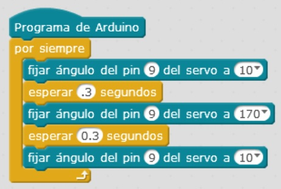

# Robot Andarín

El proyecto consiste en un robot muy sencillo hecho con materiales de reciclaje, adecuado para la materia de Robótica de 2º de ESO. Consta de una placa Arduino con alimentación de 9 v unida a un servomotor para darle movimiento. Un clip une las dos mitades del carton haciendo que el robot ande pasitos cortos.

## Materiales

- 1 Arduino
- 1 Servomotor
- 1 Clip de 9 v. con conector de alimentación
- 1 pila de 9 v.
- 3 Cables de puente macho a macho para arduino
- 1 Clip grande
- 1 Cartón corrugado de 36 x 12 cm 

## Esquema eléctrico

El servomotor dispone de tres cables: dos de alimentación (marrón = GND, rojo = VCC) y uno de señal (naranja = pin 9 de Arduino).
Enganchar el clip abierto al cartón de delante y al aspa del servomotor, que irá situado detrás, al borde del cartón. 
La placa Arduino va situada delante arriba, y su alimentación detrás abajo.

## Programación en mBlock

El robot está programado con mBlock y como se puede observar la programación es muy sencilla.

