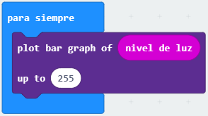

# Sensor de luz ambiente con micro:bit

Aunque la placa BBC micro:bit no tiene instalado un dispositivo especial como sensor de luz, podemos usar los diodos LED integrados para estimar la cantidad de luz.

Los LEDs son unos de los componentes opto-electrónicos más comunes utilizados para indicar la activación de una salida, sin embargo, pese a que no son dispositivos optimizados para la detección de luz, son muy efectivos como fotodiodo si los configuramos adecuadamente, por lo que pueden utilizarse como elementos de entrada en un sistema microprogramable.

Bajo condiciones de polarización inversa, un diodo LED se modela como un capacitor en paralelo con una fuente de corriente cuya intensidad es proporcional a la luz incidente en el LED, permitiendo la carga del condensador.

Cuando el pin de Entrada/Salida, donde hemos conectado el LED, se reconfigura para que funcione como entrada, el capacitor se dercargará a una velocidad aproximadamente proporcional a la cantidad de luz incidente. Al medir el tiempo que tarda este proceso podemos determinar la cantidad de luz ambiente.

## Materiales

- 1 Módulo micro:bit
- 1 Cable micro USB

## Programación

Este programa muestra el nivel de luz con un gráfico de barras en la pantalla LED de la micro:bit. Si mueves la placa a diferentes lugares con diferentes niveles de luz, el gráfico de barras cambiará.

El enlace desde donde podemos cargar el programa de aplicacion en la placa micro:bit es https://makecode.microbit.org/#editor

## VIDEO DEMO
En esta demostración podemos observar como al mover la mano sobre los diodos LED limitamos la cantidad de luz ambiente que indide sobre ellos. A su vez, el parpadeo de los LEDs solo el visible en el video, y no en la realidad, lo que demuestra que los pines se reconfiguran como entrada o salida de forma continuada, lo que permite medir la cantidad de luz incidente.

Este es el enlace para descargar el clip de video original.

https://github.com/jviHub/Practicas/raw/patch-1/sensor-luz-ambiente-conMicroBit/IMG_0327.TRIM.MOV

